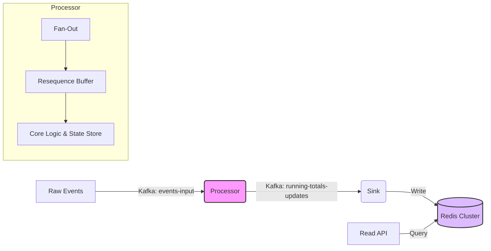

# Real-time Omni-Channel Inventory Engine

> **Generated by Google DeepMind's Antigravity**
> This project was fully designed, implemented, and documented using the [Antigravity](https://deepmind.google/technologies/antigravity/) agentic coding assistant.
> *   **Implementation Plan**: [docs/implementation_plan.md](docs/implementation_plan.md)
> *   **Task History**: [docs/task_history.md](docs/task_history.md)

## Business Overview
In a modern high-volume retail environment (e.g., a large retailer with both Ecommerce and a Chain of Stores), keeping track of accurate inventory positions in real-time is critical. Inventory transactions (stock additions, sales, adjustments) arrive at high speed from various channels and locations.

This system is a **Real-time Inventory Stream Processor** that ingests raw transaction events and maintains accurate, up-to-the-second running totals for items across multiple dimensions.

### Key Capabilities
*   **Multi-Dimensional Aggregation**: Automatically calculates totals for:
    *   **Global Item Level**: What is the total network stock for "Item A"?
    *   **Location Level**: What is the stock for "Item A" at "Store 101"?
    *   **Group Level**: What is the stock for "Item A" in "Region North"?
*   **High-Speed Ingestion**: Built on **Kafka Streams** to handle massive throughput.
*   **Low-Latency Access**: Updates are pushed to **Redis** for sub-millisecond querying by selling channels (e.g., website, POS).
*   **Strict Sequencing**: Ensures that updates are applied in exact timestamp order, even if they arrive slightly out-of-sequence, using a configurable resequencing buffer.
*   **Robust State Management**:
    *   **Late Resets**: Gracefully handles retroactive stock counts (Resets) without halting processing.
    *   **Audit Trail**: Logs every single change with full context for reconciliation.

---

## 2. Event Structure

The system accepts JSON events on the `events-input` topic.

### JSON Schema
```json
{
  "id": "ITEM-1001",
  "value": 5,
  "type": "ADD",
  "timestamp": "2024-01-01T10:00:00Z",
  "metadata": [
    "STORE:101",
    "REGION:NORTH"
  ]
}
```

*   **id** (String): Unique Item Identifier.
*   **value** (Number): Quantity change (+ for addition, - for reduction).
*   **type** (String): Operation type.
    *   `ADD`: Incremental change (Sale, Restock).
    *   `RESET`: Absolute value override (Stock Count).
*   **timestamp** (ISO 8601): When the event *occurred*.
*   **metadata** (Array): List of dimensions. The system creates a running total for the Item ID **AND** for `Item ID + Dimension` for every element in this list.

### Example Processing
**Input Event**:
`{ "id": "A", "value": 10, "meta": ["Store1", "GroupX"] }`

**Generated Updates (Redis Keys)**:
1.  `ID:A` -> Total: 10
2.  `ID:A#Store1` -> Total: 10
3.  `ID:A#GroupX` -> Total: 10

---

## 3. Architecture

Events flow through a pipeline of microservices:



1.  **Ingestion (Kafka)**: Events are published to `events-input`.
2.  **Processor (Java/Kafka Streams)**:
    *   **Fan-Out**: Duplicates events for each metadata dimension.
    *   **Resequencing**: Buffers events (default 5s) to restore strict timestamp ordering.
    *   **Core Logic**: Applies updates to the state store. Handles Late Resets by calculating the difference retroactively.
3.  **Sink (Redis Writer)**: Consumes the computed totals from `running-totals-updates` and writes them to Redis.
4.  **Read API (Spring Boot)**: Provides a REST interface for selling channels to query Redis.

---

## 4. Configuration

Key properties in `application.yml` or Environment Variables:

| Property | Env Variable | Default | Description |
| :--- | :--- | :--- | :--- |
| `app.processor.grace-period-ms` | `APP_PROCESSOR_GRACE_PERIOD_MS` | `5000` | Buffer time to allow out-of-order events to arrive. Set to `0` for immediate processing (lowest latency). |
| `app.processor.metadata-limit` | `APP_PROCESSOR_METADATA_LIMIT` | `3` | Maximum number of metadata dimensions to process per event (prevents explosion). |

---

## 5. Deployment & Operations

### A. Local Development (Docker Compose)
> [!WARNING]
> The `docker-compose.yml` setup is intended **ONLY** for local small-scale unit testing and development. Do not use this for production or load testing.

```bash
# Start Environment
./scripts/start_env.sh

# Deploy via simulated K8s scripts
./scripts/clean_restart.sh
```

### B. Kubernetes Deployment

#### 1. Local Kubernetes (Docker Desktop / Minikube)
Pre-requisites: `kubectl`, `docker`

1.  **Build Images**:
    ```bash
    ./mvnw clean package
    docker build -t inventory-processor processor/
    docker build -t inventory-sink sink/
    docker build -t inventory-api api/
    ```
2.  **Apply Manifests**:
    The `k8s/` directory contains manifests for Zookeeper, Kafka, Redis, and the Apps.
    ```bash
    kubectl apply -f k8s/infrastructure.yaml
    kubectl apply -f k8s/apps.yaml
    ```

#### 2. Google Kubernetes Engine (GKE)
1.  **Create Cluster**:
    ```bash
    gcloud container clusters create inventory-cluster --num-nodes=3 --zone=us-central1-a
    gcloud container clusters get-credentials inventory-cluster
    ```
2.  **Push Images to GCR**:
    ```bash
    docker tag inventory-processor gcr.io/[PROJECT_ID]/inventory-processor
    docker push gcr.io/[PROJECT_ID]/inventory-processor
    # Repeat for Sink and API
    ```
3.  **Update Manifests**:
    Edit `k8s/apps.yaml` to use the `gcr.io/...` image paths instead of local tags.
4.  **Deploy**:
    ```bash
    kubectl apply -f k8s/infrastructure.yaml
    kubectl apply -f k8s/apps.yaml
    ```

### C. Using External Services (Production)
For production, you should use managed services instead of the provided `infrastructure.yaml`.

#### 1. External Kafka (e.g., Confluent Cloud, MSK)
Update `processor/src/main/resources/application.yml` and `sink/src/main/resources/application.yml`:
```yaml
spring:
  kafka:
    bootstrap-servers: "pkc-xyz.us-central1.gcp.confluent.cloud:9092"
    properties:
      security.protocol: SASL_SSL
      sasl.jaas.config: "..."
      sasl.mechanism: PLAIN
```

#### 2. External Redis (e.g., GCP Memorystore, AWS ElastiCache)
Update `sink/src/main/resources/application.yml` and `api/src/main/resources/application.yml`:
```yaml
spring:
  data:
    redis:
      host: "10.0.0.5" # Your managed Redis IP
      port: 6379
```

With external services configured, you **skip** deploying the Zookeeper/Kafka/Redis sections of `k8s/infrastructure.yaml` and only deploy the application pods.

